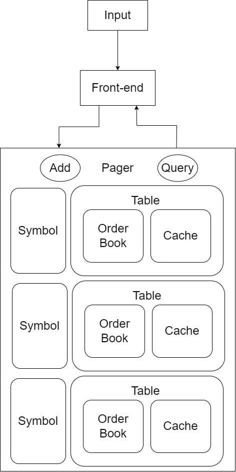

# StockQL
StoclQL is a data warehouse software for time-order series data in trading markets.

This database design attempts to efficiently store and retrieve time-ordered series data, specifically for trading markets.

The software attempts to deliver an SQL-like experience with its REPL front-end and querying format.

> **_NOTE:_** This software is currently incomplete and is just a fun little project.

## To do:
- Fix critical cache bug
- Add input parser
- Fix file directories
- Add security encryption
- General support for different file types
- Restructure the project
- Add automatic testing
- Move to Cmake

## Design Plans


### Front-end
The front-end of the database mimics an SQL database's REPL front-end. It runs an infinite loop while accepting user input. There, the user can run database operations following the instruction format. The database will exit upon accepting the exit command and will save the database before closing.

### Back-end
The database will use a Pager class to wrap around all available tables. This is achieved by using a map to hold the different tables of different tradable instruments. Each tradable instrument will have its own table which consists of an LRU cache and an order_book. 

The cache is used to temporarily store data that is frequently accessed, it is specifically used for indexing query results. It functions by adding data entries on database operations and removing the least recently used entry. On a cache miss it dynamically loads data entries from their corresponding order books by serially searching from their written database file. This reduces the need for expensive database calls, thereby improving the overall performance of the system.

This design allows for efficient data retrieval and storage, as each tradable instrument will have its own dedicated table. This design choice allows for less cache misses when database operations are focused grealy on one instrument. However, it's performance suffers when context switching between tradable instruments frequently occur.

## Implementation Details
Due to the time constraints, the full details of the design plan have not yet been fully implemented.
The Pager class is not complete (can be seen as commented code), thus the software currently only supports one table for a singular tradable instrument.

The current software does not support executing seperate file instructions. Meaning, that you will have to type the instructions into it as input when you start it. Thus, it is unable to load from the `.log` files. Given more time, this will be a feature.

Additionally, some of the implementation is either faulty, not fully efficient, or has not been thoroughly tested. Additional details are found in the comments of the function. With more time, these bugs can be debugged.

Additionally, the full list of SQL commands have not yet been implemented as the front-end parser is only a simple tokenizer with checking. Currently, only database additions, updates, and queries are supported.

Currently, the database lookup is performed serially. With more time, a B-tree can be implemented for lookup which can significantly speedup lookup times in large databases. 

## Future Plans
- Fix faulty functions
- Paging of different tradable instruments
- Full functionality with full list of SQL commands with a full parsing and compiling engine.
- B-tree lookup

## Getting Started
A makefile is provided to build the project. Ensure you have make and g++ installed, then run ```make```.

To start the database, simply run:
```
./main.out
```
This will generate a database called `database.db` in the `data/db/` subdirectory.
To change the name of the database, simply add your file name in the arguments.
```
./main.out my_db
```
> **_NOTE:_** The program does not create the data/db/ subdirectories on its own yet, please ensure that these subdirectories exist before running (Hence why the data subdirectory is included in the zip file). 

To wipe the existing `.db` files and start a new one, simply run:
```
make rmdb
```

## Database Operations
When the software is running, it will display a pseudo-terminal for input commands.
```
db >
```
Here, you can type the currently supported database operation.
To insert or add a new data entry, 
```
db > epoch order_id symbol order_side order_category price quantity
```
The `order_category` will decide how it is updated into the order book.
Here is an example.
```
db > 1609722840017828773 7372151260093983964 SCH SELL NEW 111.0 1
```
This creates 1 new sell data entry at at price 111.0 for SCH if an entry with the same price does not exist. Otherwise, it simply adds the quantities.

> **_NOTE:_** As the current iteration of the software only supports one tradable instrument. It will not properly parse the symbol (`SCH`). Thus, no matter what symbol is used, it will be stored into the same table.

Currently, there are only a fixed amount of query fields supported:
- ask1p ~ ask5p: ith lowest ask price
- ask1q ~ ask5q: the corresponding quantity at the ith lowest ask price
- bid1p ~ bid5p: ith highesst bid price
- bid1q ~ bid5q: the corresponding quantity at the ith highest bid price
- last_trade_price: last traded price
- last_trade_quantity: corresponding quantity of the last traded price

To query,
```
db > select symbol epoch query_field_1 query_field_2 ...
```

Additionally we have two shorthands for special queries:
```
db > select symbol top
```
which prints out the price and quantity of the current top 5 bids and asks, as well as
```
db > select symbol *
```
which prints out the price and quantity of the whole orderbook.

